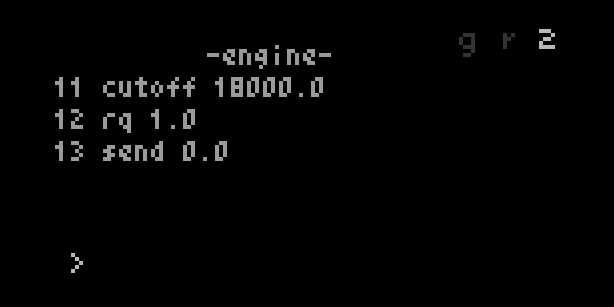
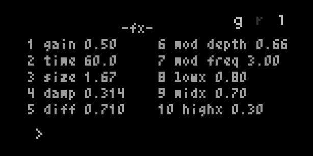
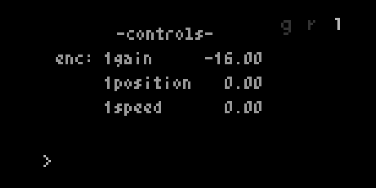
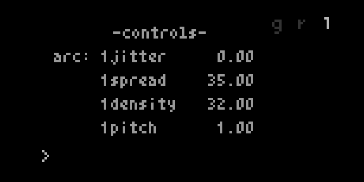
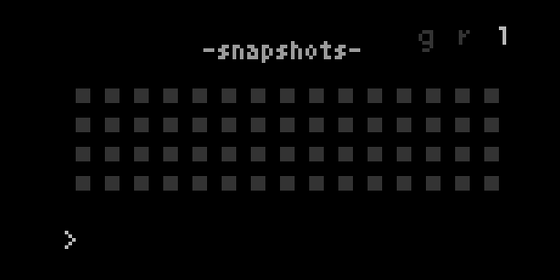
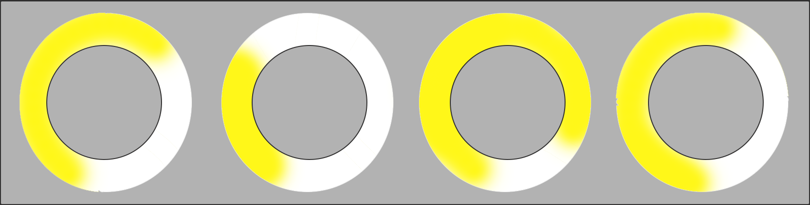
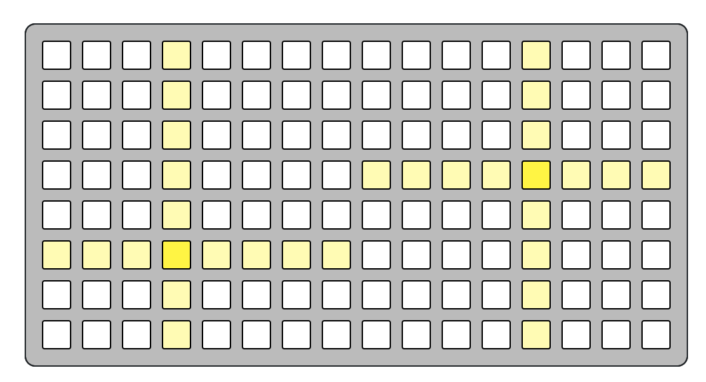
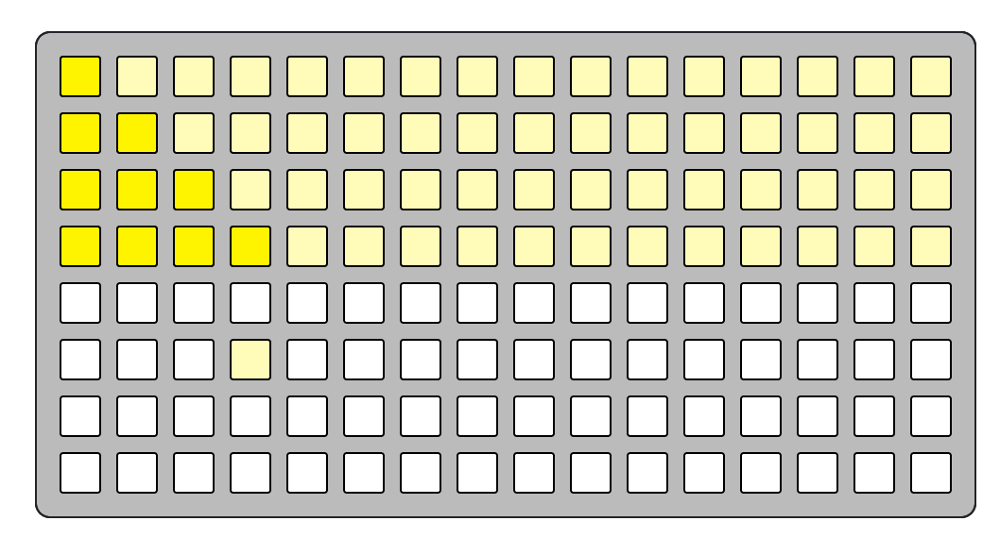

# silos
a live granular instrument for norns

----------

#### silos granular engine, thresher, contains 3 tracks, each with its own 8 second buffer. the parameters for controlling the engine are:

* gain = output level for the voice (0 - 1)
* position = position within the buffer (0 - 1)
* speed = playhead speed (-4 - 4)
* jitter = position modulation (0 - 100)
* size = grain size (0 - 500ms)
* flux = size modulation amount (0 - 1)
* pitch = grain pitch (-4 - 4)
* fdbk = feedback (0 - 1)
* density = frequency of grains (0 - 512hz)
* dispersal = density modulation (0 - 1)
* spread = pan position modulation (0 - 100)
* cutoff = frequency cutoff of low-pass filter (20 - 18000hz)
* rq = reciprical of q/resonance (0 - 1) *0 is full resonance, 1 is no resonance*
* fx send = send amount (0 - 1)
* gate fade time = the duration of fade in/out time when toggling gate, in seconds (0 - 30secs)

*nb: speed and pitch both work as rate controls. 2 is twice as fast/1 octave up. gate fade time can be set in the parameter menu under the config section*

#### there is also an fx bus that features a lush modulated reverb followed by a bit crusher. the fx parameters are:

* gain = fx output level (0 - 1)
* time = t60/ the time it takes for the sound to decay by -60db (0 - 60)
* size = size of the space (.5 - 5)
* dampening = damping of high-frequencies as the reverb decays (0 - 1)
* diffusion = shape of early reflections (0 - 1)
* modulation depth = depth of delay-line modulation (0 - 1)
* modulation frequency = delay-line modulation freq (0 - 10)
* lowx = multiplier for the reverberation time within the low band (0 - 1)
* midx = multiplier for the reverberation time within the mid band (0 - 1)
* highx = multiplier for the reverberation time within the high band (0 - 1)
* quality = bit depth (4/8/12/32)

----------

# control

## norns

launching silos lands you in a fairly minimal state. in the top right corner of your screen are indicators for gate, recording, and your current track number. at the bottom of your screen you'll find the command prompt.

* key 1 = alt
* key 2 = gate toggle - (voice on/off)
* key 3 = record toggle

* alt + enc 2 = track/voice select
* alt + enc 3 = info display navigation

* alt + key 3 = info display toggle

if you'd like to see a bit more information, press **alt + key 3** or **ESC** on your keyboard to toggle the info display. there are pages for **engine parameters**, **fx**, **control assignments**, and **snapshots**.

use **alt + enc 3** or your **LEFT/RIGHT** arrow keys to navigate.

### engine parameters

### fx

### control assignments

### snapshots

-----------

## arc

the arc adds four extra encoders. assign controls with ``arc id track/fx control_number``

* `` arc 1 3 4`` = assign track 3 jitter to arc ring 1
* ``arc 4 fx 1`` = assign fx gain to arc ring 4

## grid

the grid has two modes of operation. mode 1 is two 8x8 **x/y** pads, mode 2 is **snapshot** mode. switch modes with ``grid_mode n`` where n = 1 or 2. more grid modes will likely be added in the future.

### x/y mode

assign controls to the x/y coordinates using ``gridx`` or ``gridy``.

``gridx id track/fx control_number``
  * ``gridy 2 1 5`` = assign track 1 size to the second y coordinate (right side oof grid)
  * ``gridx 1 fx 1`` = assign fx gain to the first x coordinate (left side of grid)

### snapshot mode

in snapshot mode, holding the lower dimly lit cell and pressing one of the top 3 rows will save a snapshot of your parameter settings. row 1 will save snaps for track 1, row 2 track 2, and so on. 
a cell containing a snapshot will glow brightly. pressing a brightly lit cell will recall the associated snapshot. 

## the command prompt

there are several commands to configure controls, set parameter values, and save/load various sets of data.

### Assign controls:
  * engine: ``controller id track control_number``
  * fx: ``controller id "fx" fx_control_number``
    * valid ``controller``s are:
      * enc
      * arc
      * gridx
      * gridy
    * valid ``id``s are:
      * enc = 1 - 3
      * arc = 1 - 4
      * gridx/gridy = 1 - 2
    * engine ``control_number``s are:
      * 1 = gain
      * 2 = position
      * 3 = speed
      * 4 = jitter
      * 5 = size
      * 6 = pitch
      * 7 = fdbk
      * 8 = density
      * 9 = dispersal
      * 10 = spread
      * 11 = fx send
    * ``fx_control_number``s are:
      * 1 = gain
      * 2 = time
      * 3 = size
      * 4 = dampening
      * 5 = diffusion
      * 6 = modulation depth
      * 7 = modulation frequency
      * 8 = lowx
      * 9 = midx
      * 10 = highx
      * 11 = quality
  * for example:
    * ``enc 3 1 6`` = set encoder 3 to track 1 density control
    * ``arc 2 fx 6`` = set arc ring 2 to fx mod_depth

    *nb: control lists can be viewed in app by toggling info display*

### build control macros: each of the norns encoders has an accompanying macro slot.

  * first add controls to the macro slot you want to use
    * ``macro encoder_id track control_number multiplier``
        * ``macro 3 1 8 .5`` = add track 1 density to macro 3 at half strength
        * ``macro 3 2 5 -1`` = add track 2 size to macro 3 at -1 strength (full speed backwards)
        * ``macro 3 fx 6 1`` = add the reverb modulation depth control to macro 3 and full strength
  * enable the macro
    * ``enc enc_id macro state``
        * ``enc 3 macro 1`` = enable macro control on encoder 3
  * disable the macro by setting its state to 0
      * ``enc 3 macro 0``
  * clear the macro with
    * ``macro macro_id clear``
        * ``macro 3 clear`` = clear encoder 3 macro

*nb: multiplier can be negative numbers! this allows one param to increase while others decrease or vice versa*

----------

### set parameters:
  * ``control_name track value``
    * ``size 2 150`` = set track 2 size to 150ms
  * ``rand track control_number``
    * ``rand 1 8`` = set track 1 spread to a random value
  * ``rrand track control_number low high``
    * ``rrand 3 5 10 150`` = set track 3 size to a random value between 10 and 150

### set multiple parameters:
  * ``gates state1 state2 state3``
    * ``gate 1 1 0`` = set gates 1 and 2 to on, gate 3 to off
  * ``records state1 state2 state3``
    * ``record 0 0 0 1`` = set records 1, 2, and 3 off
  * ``gate`` and ``record`` have the aliases ``g`` and ``r`` for convenience
    * ``g 1 1 0 `` and ``r 0 0 1 `` are valid

----------

### store and recall parameter snapshots
  * ``snap id track``
    * ``snap 10 2`` = save a parameter snapshot for track 2 in slot 10
  * ``load id track``
    * ``load 5 3`` = recall track 3 parameter snapshot in slot 5
  * ``id`` = a number 1-16
  * ``snap`` and ``load`` have the aliases ``s`` and ``l`` for convenience
    * ``s 1 1`` and ``l 1 1`` are valid

### save and load state
  * ``save_state id``
    * ``save_state test`` = save your current script state in a file called ``test.state``
  * ``load_state id``
    * ``load_state new_song`` = load ``new_song.state`` if it exists.

### save and load pset
  * ``save_pset`` = this is the same as saving a pset in the parameters menu.
  * ``load_pset`` = this is the same as loading a pset in the parameters menu.

*nb: state includes control assignments, macros, snapshots etc... pset is the parameter values*

----------

### key bindings
  * ctrl + g = toggle gate
  * ctrl + r = toggle record
  * ctrl + (1-3) = track select
  * esc = toggle info display
    * while info display is active, left and right arrow keys navigate info pages
        
